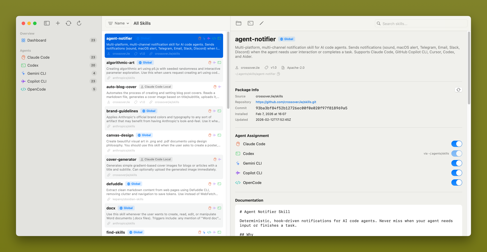

<p align="center">
  
</p>

<h1 align="center">SkillDeck</h1>

<p align="center">
  <em>The desktop GUI for managing AI code agent skills on macOS.</em>
</p>

<p align="center">
  <a href="https://github.com/crossoverJie/SkillDeck/actions/workflows/ci.yml"></a>
  <a href="https://github.com/crossoverJie/SkillDeck/releases/latest"></a>
  
  
  
</p>

---

**SkillDeck** is the first desktop GUI for managing skills across multiple AI code agents — [Claude Code](https://docs.anthropic.com/en/docs/claude-code), [Codex](https://github.com/openai/codex), [Gemini CLI](https://github.com/google-gemini/gemini-cli), and [Copilot CLI](https://docs.github.com/en/copilot/using-github-copilot/using-github-copilot-in-the-command-line). No more manual file editing, symlink juggling, or YAML parsing by hand.

## Screenshots

<!-- Replace the placeholder images below with actual screenshots -->

<p align="center">
  
</p>

<p align="center">
  
  
  
</p>

## Features

- **Multi-Agent Support** — Claude Code, Codex, Gemini CLI, Copilot CLI, OpenCode
- **Unified Dashboard** — All skills in one three-pane macOS-native view
- **One-Click Install** — Clone from GitHub, auto-create symlinks and update lock file
- **Update Checker** — Detect remote changes and pull updates with one click
- **SKILL.md Editor** — Split-pane form + markdown editor with live preview
- **Agent Assignment** — Toggle which agents a skill is installed to via symlink management
- **Auto-Refresh** — File system monitoring picks up CLI-side changes instantly

> See the full feature list and roadmap in [docs/FEATURES.md](docs/FEATURES.md).

## Installation

### Download (Recommended)

Download the latest universal binary from [GitHub Releases](https://github.com/crossoverJie/SkillDeck/releases):

1. Download `SkillDeck-vX.Y.Z-universal.zip`
2. Unzip and move `SkillDeck.app` to `/Applications/`
3. On first launch, macOS will block unsigned apps. To open:
   ```bash
   xattr -cr /Applications/SkillDeck.app
   ```
   Or: Right-click → Open → "Open" in the dialog

### Homebrew

```bash
brew tap crossoverJie/skilldeck && brew install --cask skilldeck
```

### Build from Source

Requires macOS 14.0+ (Sonoma), Xcode 15.0+, Swift 5.9+.

```bash
git clone https://github.com/crossoverJie/SkillDeck.git
cd SkillDeck
swift run SkillDeck

# Or open in Xcode
open Package.swift    # then press Cmd+R
```

Run tests:

```bash
swift test
```

## Supported Agents

| Agent | Skills Directory | Detection |
|-------|-----------------|-----------|
| [Claude Code](https://docs.anthropic.com/en/docs/claude-code) | `~/.claude/skills/` | `claude` binary + `~/.claude/` dir |
| [Codex](https://github.com/openai/codex) | `~/.agents/skills/` (shared) | `codex` binary |
| [Gemini CLI](https://github.com/google-gemini/gemini-cli) | `~/.gemini/skills/` | `gemini` binary + `~/.gemini/` dir |
| [Copilot CLI](https://docs.github.com/en/copilot/using-github-copilot/using-github-copilot-in-the-command-line) | `~/.copilot/skills/` | `gh` binary |

## Architecture

MVVM with `@Observable` (macOS 14+). The filesystem is the database — skills are directories containing `SKILL.md` files. Services use Swift `actor` for thread-safe file system access.

```
Views → ViewModels (@Observable) → SkillManager → Services (actor)
```

See [docs/DEVELOPMENT.md](docs/DEVELOPMENT.md) for the full architecture guide, design decisions, and development setup.

## Contributing

1. Fork the repository
2. Create a feature branch (`git checkout -b feat/my-feature`)
3. Run tests (`swift test`)
4. Open a Pull Request

See [docs/DEVELOPMENT.md](docs/DEVELOPMENT.md) for environment setup and coding conventions.

## License

[MIT](LICENSE)
